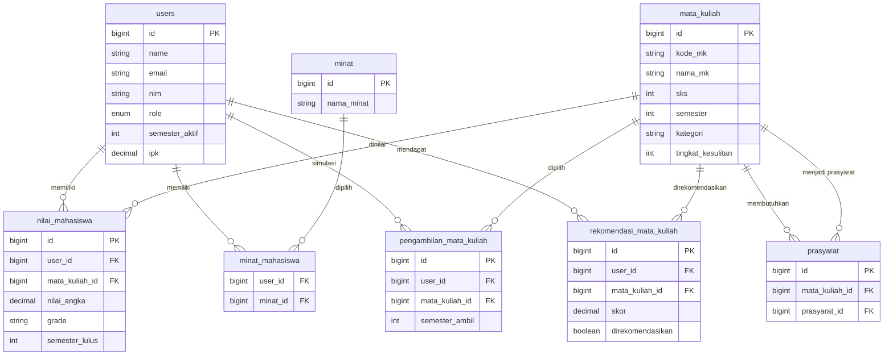

# ERD & Alur Sistem — Sistem Rekomendasi Mata Kuliah Mahasiswa

## Entity Relationship Diagram



## Mapping Entity Lama → Baru

| Sistem Lama | Sistem Baru |
|-------------|-------------|
| Jurusan (Major) | MataKuliah |
| KriteriaJurusan | KategoriMataKuliah (field `kategori` pada mata_kuliah) |
| PilihanJurusan | PengambilanMataKuliah |
| RekomendasiJurusan | RekomendasiMataKuliah |
| Student | User (role mahasiswa) |
| Score | NilaiMahasiswa |

## Alur Sistem

### 1. Autentikasi
```
Login → Cek role → Admin Dashboard / Mahasiswa Dashboard
```

### 2. Admin — Kelola Data Master
```
Admin login
  → CRUD Mata Kuliah (kode, SKS, semester, kategori, kesulitan)
  → CRUD Minat (Pemrograman, Jaringan, dll.)
  → CRUD Prasyarat (relasi antar mata kuliah)
  → CRUD Nilai Mahasiswa
  → CRUD Data Mahasiswa (NIM, semester aktif, IPK)
```

### 3. Mahasiswa — Input Minat
```
Mahasiswa login → Pilih Minat → Simpan ke pivot minat_mahasiswa
```

### 4. Algoritma Rekomendasi (`RekomendasiMataKuliahService`)

```
INPUT: User (semester_aktif, minat, nilai, pengambilan simulasi)

1. Ambil semua mata kuliah

2. FILTER (eligible):
   - semester_mk <= semester_aktif mahasiswa
   - belum pernah diambil (tidak ada di nilai_mahasiswa)
   - semua prasyarat lulus dengan grade minimal C

3. HITUNG SKOR per mata kuliah:
   score = score_minat + score_nilai - penalty_kesulitan - penalty_sks

   A. score_minat: +40 jika kategori MK sesuai minat mahasiswa
   B. score_nilai: +30 (A), +20 (B), +10 (C) dari grade terbaik di kategori yang sama
   C. penalty_kesulitan: tingkat_kesulitan × 5
   D. penalty_sks: -20 jika total SKS simulasi > 24

4. URUTKAN dari skor tertinggi

5. SIMPAN ke rekomendasi_mata_kuliah

OUTPUT: Daftar MK dengan skor dan status Direkomendasikan / Tidak Direkomendasikan
```

### 5. Simulasi Pengambilan MK
```
Mahasiswa pilih MK untuk semester berikutnya
  → Simpan ke pengambilan_mata_kuliah
  → Hitung ulang rekomendasi dengan penalty SKS jika > 24
```

### 6. Visualisasi (Chart.js)
```
Bar Chart  → Skor setiap MK direkomendasikan
Pie Chart  → Persentase kategori MK direkomendasikan
Line Chart → Riwayat IP dan IPK per semester
```

## Akun Demo

| Role | Email | Password |
|------|-------|----------|
| Admin | admin@demo.test | password |
| Mahasiswa | aulia@demo.test | password |
| Mahasiswa | bima@demo.test | password |
| Mahasiswa | citra@demo.test | password |

## Menjalankan

```bash
php artisan migrate:fresh --seed
php artisan serve
```

Akses: http://localhost:8000/login
